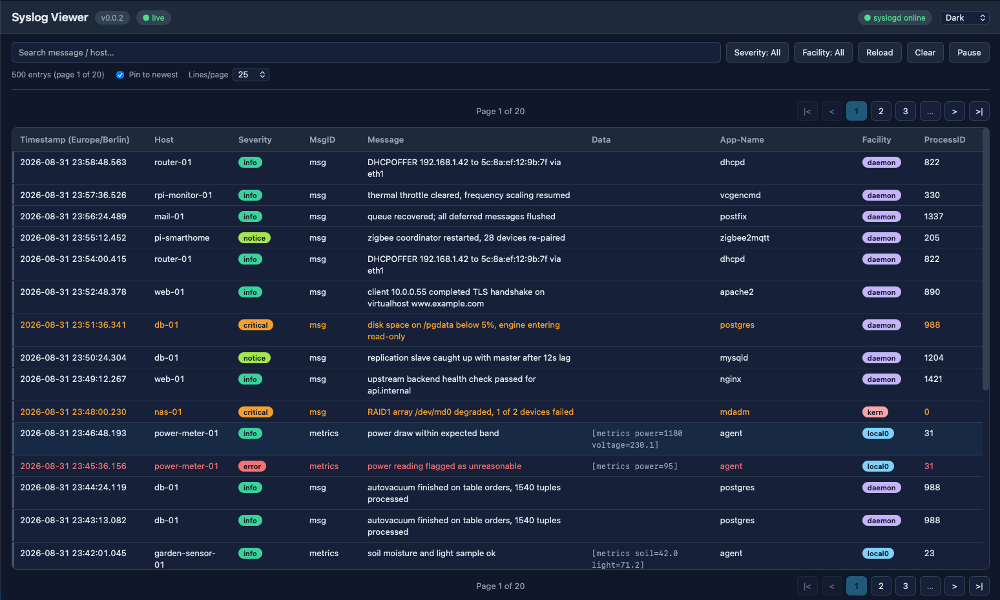

# Configurable Syslog Server

A small, dependency-free syslog toolkit written in C17. It receives syslog
messages over UDP, writes them to a log file in **RFC 5424** format (with
automatic rotation and optional daemon mode), and ships with a test client
and a web viewer for the log.

The project builds three binaries, all sharing one version (`src/version.h`):

- `syslogd` — the syslog server (UDP listener, RFC 5424 log writer, rotation,
  daemon mode, status file).
- `syslogd_client` — sends a test syslog message over UDP.
- `syslogd_web` — web viewer on port 8090 (HTML table, JSON API, live
  Server-Sent-Events stream, demo page).

## Features

- UDP syslog receiver with configurable port and log file (`-p`, `-l`)
- RFC 5424 log format: `<PRI>1 TIMESTAMP HOSTNAME APP-NAME PROCID MSGID SD MSG`.
  Complete RFC 5424 messages are passed through unchanged; simple `<PRI>msg`
  messages are wrapped with the receive time and short hostname.
- PRI decoding to facility and severity names
- Automatic numbered log rotation at a configurable max size
  (`SYSLOGD_MAX_LOG_SIZE`), keeping a bounded history (`SYSLOGD_MAX_LOG_FILES`)
  as `.1`, `.2`, ... `.N`
- Daemon mode with PID file (`/var/run/custom_syslog.pid`) and a status file
  (`/var/run/custom_syslog.status`: version, pid, port, logfile)
- Configuration via command-line flags **or** `SYSLOGD_*` environment variables
- Graceful shutdown on SIGINT/SIGTERM
- Test client to inject messages, web viewer to inspect the log and its
  rotated history
- Shared version for all tools: `-V` prints `SYSLOGD_VERSION` from `src/version.h`

## Requirements

- C17 compiler (`clang` or `gcc`)
- `make`
- macOS or Linux

For a glibc build (e.g. the Docker image / Raspberry Pi) the source needs
`_GNU_SOURCE` (`NI_NAMEREQD`, `getopt`/`optarg`, `struct timeval`):
`make CFLAGS="-std=c17 -D_GNU_SOURCE -Wall -Wextra -pedantic -O2"`.

## Build

```
make          # release build into build/
make debug    # debug build (-g -O0)
make clean    # remove build/
```

## Usage

Syslog server (foreground, port 5514):

```
./build/syslogd -p 5514 -l /tmp/custom_syslog.log
```

Send a test message:

```
./build/syslogd_client -p 5514 -f local0 -s info 127.0.0.1 "hello world"
```

View the log in a browser:

```
./build/syslogd_web
# open http://localhost:8090/
```

All binaries print their option set via `-h` and their version via `-V`
(see [docs/usage.md](docs/usage.md) for the full reference). Environment note:
listening on the default port 514 requires root privileges; use a high port
such as 5514 for testing. The web viewer reads the same log file as the server
(`/var/log/custom_syslog.log` by default), so start the server with
`-l /var/log/custom_syslog.log` (or `SYSLOGD_LOG_FILE`) to feed it.

## Environment variables

All configuration can also be supplied through `SYSLOGD_*` environment
variables — convenient for systemd or Docker. Command-line flags take
precedence where both are given. The viewer (`syslogd_web`) shares
`SYSLOGD_LOG_FILE` and `SYSLOGD_MAX_LOG_FILES` with the server, so its log and
history stay in sync automatically; only the web port is viewer-specific.

| Variable | syslogd | syslogd_web | Default |
| --- | :---: | :---: | --- |
| `SYSLOGD_PORT` | yes | — | `514` |
| `SYSLOGD_LOG_FILE` | yes | yes | `/var/log/custom_syslog.log` |
| `SYSLOGD_MAX_LOG_SIZE` | yes | — | `5242880` (5 MB) |
| `SYSLOGD_MAX_LOG_FILES` | yes | yes | `5` |
| `SYSLOGD_WEB_PORT` | — | HTTP port | `8090` |

The server names rotated history files `<logfile>.1` … `<logfile>.N` (newest
history first, `.N` oldest). `syslogd_web` reads the same history the server
keeps, so the viewer shows past segments in addition to the current log.

Example:

```bash
SYSLOGD_PORT=5514 SYSLOGD_LOG_FILE=/tmp/custom.log \
    SYSLOGD_MAX_LOG_SIZE=1048576 ./build/syslogd
SYSLOGD_WEB_PORT=8090 SYSLOGD_LOG_FILE=/tmp/custom.log ./build/syslogd_web
```

## Web viewer

`syslogd_web` is a dependency-free single-page web UI that renders the log as
a sortable, filterable table with a live tail. It needs no build step and no
external libraries — a plain HTTP static server plus two small JSON endpoints.



Features:

- search box and multi-select severity/facility filters
- pagination ("Lines/page", "All") on a sortable table
- dark / light / system theme
- live tail via Server-Sent Events; "Pin to newest" highlights freshly arrived
  rows with a transient grey glow
- Reload / Clear / Pause controls
- live-connection indicator and a `syslogd` online/offline badge in the header

API (all `GET`, JSON except the stream):

- `/api/log?limit=N` — newest N lines across the rotated history **and** the
  current log, newest first.
- `/api/stream` — Server-Sent Events live tail (initial snapshot that includes
  rotated history, then appends of new lines).
- `/api/version` — web viewer name/version.
- `/api/status` — syslogd version/pid/online from the server status file.
- `/demo` (and `/demo/*`) — the same viewer, but every API call reads the
  bundled sample log `web/sample-500.log` (500 RFC 5424 lines over 10 hours)
  instead of the live log file. Reached by URL only; there is no button.

Timestamps are written/emitted as UTC RFC 3339 with milliseconds
(`2026-08-30T21:17:47.874Z`) and converted to local time in the browser; the
Timestamp column header shows the browser's time-zone id.

## Sample output

Log line written after receiving `<134>hello world` from a host (wrapped form):

```
<134>1 2026-08-30T12:00:01.003Z hostname - - - - hello world
```

Foreground server also prints to stdout:

```
[127.0.0.1:63128] local0.info: hello world
```

## License

MIT — see [LICENSE](LICENSE). See [CONTRIBUTING.md](CONTRIBUTING.md) for how
to report bugs and contribute.